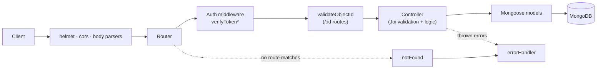
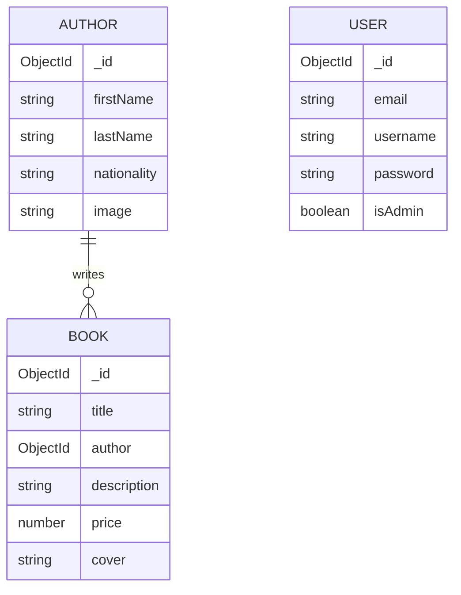

# BookStore API


REST API for an online book store. It serves a public catalog of books and authors, handles user accounts with JWT authentication and email-based password reset, accepts verified image uploads, and restricts catalog management to administrators.

**Maturity:** feature-complete for a catalog backend and covered by the security controls listed below. Several operational items (rate limiting, health check, automated tests) are still open. Complete the [Production Readiness Checklist](#production-readiness-checklist) before exposing it to the public internet.

## Table of Contents

- [Features](#features)
- [Architecture](#architecture)
- [Tech Stack](#tech-stack)
- [Getting Started](#getting-started)
- [Configuration](#configuration)
- [Authentication & Authorization](#authentication--authorization)
- [API Reference](#api-reference)
- [Data Models](#data-models)
- [Validation Rules](#validation-rules)
- [Image Uploads](#image-uploads)
- [Password Reset Flow](#password-reset-flow)
- [Error Handling](#error-handling)
- [Security](#security)
- [Deployment](#deployment)
- [Production Readiness Checklist](#production-readiness-checklist)
- [Troubleshooting](#troubleshooting)
- [Development Guide](#development-guide)
- [Roadmap](#roadmap)
- [Changelog](#changelog)
- [Author & License](#author--license)

## Features

- **Catalog:** full CRUD for books and authors, with the author embedded in book responses.
- **Accounts:** registration, login, and profile management with owner-or-admin access.
- **Authentication:** stateless JWT (1-day expiry) and bcrypt password hashing.
- **Password reset:** emailed, 15-minute, single-purpose links; the response never reveals whether an account exists.
- **Uploads:** admin-only image upload verified by size, extension, declared MIME type and real file content.
- **Querying:** pagination on every list endpoint and price-range filtering on books.
- **Validation:** Joi on request bodies and query strings, ObjectId checks on every `:id` route, Mongoose constraints as a second layer.
- **Error handling:** one central handler that maps Mongoose and body-parser errors to the right HTTP status and hides internals in production.
- **Security headers and CORS** through `helmet` and `cors`.

## Architecture

### Request pipeline



Routes only declare paths and middleware. Controllers hold the logic and each resource keeps its Joi schemas next to its controller. Controllers are wrapped in `express-async-handler`, so any thrown or rejected error ends up in `errorHandler`.

### Project structure

```
bookStore/
├── app.js                          App setup: middleware, routes, error handlers, server start
├── seeder.js, data.js              Development seeding script and sample data
├── .env.example                    Template for environment variables
├── config/
│   └── connectToDB.js              MongoDB connection (exits the process on failure)
├── controllers/
│   ├── authors/
│   │   ├── authors.controller.js
│   │   └── utils/validateAuthor.js
│   ├── books/
│   │   ├── books.controller.js
│   │   └── utils/validateBook.js
│   └── users/
│       ├── auth.controller.js      Register, login, forgot/reset password
│       ├── users.controller.js     List, get, update and delete users
│       ├── services/sendEmail.service.js   Nodemailer transport and reset email
│       └── utils/validateUser.js
├── middleware/
│   ├── errorHandlers.js            notFound and the central errorHandler
│   ├── hashPassword.js             bcrypt hash and compare helpers
│   ├── validateObjectId.js         Rejects malformed :id params with 400
│   └── verifyToken.js              JWT checks: any user, owner-or-admin, admin only
├── models/                         Author, Book and User Mongoose models
├── routes/
│   ├── authors/, books/            CRUD routes
│   ├── users/                      auth.route.js and users.route.js
│   └── uploads/uploads.route.js    Image upload pipeline
├── views/                          EJS pages for the password reset flow
└── images/                         Uploaded images (git-ignored), served as static files
```

## Tech Stack

| Area            | Packages                                                       |
| --------------- | -------------------------------------------------------------- |
| Runtime         | Node.js **20.11+** (ES Modules, `import.meta.dirname`)         |
| Web framework   | Express 5, `express-async-handler`                             |
| Database        | MongoDB, Mongoose 9                                            |
| Auth & security | `jsonwebtoken`, `bcryptjs`, `helmet`, `cors`                   |
| Validation      | Joi 18                                                         |
| Uploads         | `multer` (memory storage), `file-type`                         |
| Email & views   | `nodemailer`, `ejs`                                            |
| Config & dev    | `dotenv`, `nodemon`                                            |

## Getting Started

### Prerequisites

- Node.js 20.11 or newer
- A MongoDB instance: local, Docker, or MongoDB Atlas
- An SMTP account if you want password-reset emails (a free [Ethereal](https://ethereal.email) account works for development)

### Install and run

```bash
git clone https://github.com/OmarKh006/bookStore.git
cd bookStore
npm install
cp .env.example .env        # then fill in the values, see Configuration
npm run dev                 # nodemon, restarts on changes
# or
npm start                   # plain "node app.js"
```

The API listens on `http://localhost:5000` unless `PORT` is set. The process **exits immediately** if it can't connect to MongoDB.

> There is no root route and no health endpoint yet. A `404` JSON response from `GET /` is expected.

### Create the first admin

Registration always creates a regular user, so the first admin is promoted in the database:

```bash
# 1. register a user through the API (see Quick tour below), then:
mongosh "$MONGO_URI" --eval 'db.users.updateOne({ email: "admin@example.com" }, { $set: { isAdmin: true } })'
```

Log in again afterwards. Admin rights are read from the token, so an old token keeps the old role.

### Quick tour

```bash
BASE=http://localhost:5000

# Register (returns data.token)
curl -X POST $BASE/api/auth/register -H "Content-Type: application/json" \
  -d '{"email":"admin@example.com","username":"admin","password":"Str0ng!Pass"}'

# Log in as the promoted admin and copy data.token
curl -X POST $BASE/api/auth/login -H "Content-Type: application/json" \
  -d '{"email":"admin@example.com","password":"Str0ng!Pass"}'

# Create an author, then a book that references the author's _id
curl -X POST $BASE/api/authors -H "Content-Type: application/json" -H "token: <JWT>" \
  -d '{"firstName":"Nassim","lastName":"Taleb","nationality":"Lebanon"}'

curl -X POST $BASE/api/books -H "Content-Type: application/json" -H "token: <JWT>" \
  -d '{"title":"Antifragile","author":"<AUTHOR_ID>","description":"Things that gain from disorder","price":11,"cover":"soft cover"}'

# Public reads
curl "$BASE/api/books?minPrice=8&maxPrice=12&pageNumber=1"
```

### Seeding sample data (development only)

```bash
node seeder -import-authors    # insert sample authors
node seeder -import            # insert sample books
node seeder -delete            # delete all books (authors are kept)
```

The sample books in `data.js` reference **hard-coded author ids** that won't exist in a fresh database, and the sample authors don't match the sample books. Treat the seeder as a development helper that still needs rework (see [Roadmap](#roadmap)). The script doesn't exit by itself; press `Ctrl+C` after the success message.

## Configuration

All settings are environment variables, loaded from `.env` by `dotenv`. Copy `.env.example` as a starting point and never commit `.env`.

| Variable      | Required         | Description                                                                                          |
| ------------- | ---------------- | ---------------------------------------------------------------------------------------------------- |
| `MONGO_URI`   | yes              | MongoDB connection string, e.g. `mongodb://localhost:27017/bookStoreDB`.                             |
| `JWT_SECRET`  | yes              | Secret used to sign login tokens and as part of the password-reset token secret. Use 32+ random bytes. |
| `PORT`        | no               | Port to listen on. Default `5000`.                                                                   |
| `NODE_ENV`    | recommended      | Set to `production` in production. It hides internal error messages on 5xx responses.                |
| `BASE_URL`    | for reset emails | Public base URL of this API, used to build reset links, e.g. `https://api.example.com` (no trailing slash). |
| `SMTP_HOST`   | for reset emails | SMTP server host.                                                                                    |
| `SMTP_PORT`   | for reset emails | SMTP server port (`587`, `465`, ...).                                                                |
| `SMTP_SECURE` | for reset emails | `true` for implicit TLS (port 465), otherwise `false`.                                               |
| `SMTP_USER`   | for reset emails | SMTP username.                                                                                       |
| `SMTP_PASS`   | for reset emails | SMTP password or app password.                                                                       |
| `SMTP_FROM`   | no               | Sender address. Falls back to `SMTP_USER`.                                                           |

Generate a strong secret with:

```bash
openssl rand -base64 48
```

> The app does **not** validate these variables at startup. A missing `JWT_SECRET` fails at the first login, and a missing `BASE_URL` produces reset links that start with `undefined/`. Check them before every deployment.

For local email testing with Ethereal, the server logs a preview URL for every sent message, so you can read the reset email without a real inbox.

## Authentication & Authorization

Send the JWT in a custom **`token`** header. Register and login return it as `data.token`.

```
token: <JWT>
```

The token payload is `{ id, isAdmin }` and it expires after **1 day**. There is no refresh token and no server-side revocation: a token stays valid until it expires, even if the user is deleted or demoted in the meantime.

### Access matrix

| Resource                                         | Public | Owner | Admin |
| ------------------------------------------------ | :----: | :---: | :---: |
| Register, login, password reset pages            |   ✅   |       |       |
| `GET` books and authors                          |   ✅   |       |       |
| `POST`, `PUT`, `DELETE` books and authors        |        |       |  ✅   |
| `GET /api/users`                                 |        |       |  ✅   |
| `GET`, `PUT`, `DELETE /api/users/:id`            |        |  ✅   |  ✅   |
| `POST /api/uploads`                              |        |       |  ✅   |

"Owner" means the token's `id` equals the `:id` in the URL.

### Authentication errors

| Status | Message                             | When                                   |
| ------ | ----------------------------------- | -------------------------------------- |
| 401    | `Unauthorized action`               | No `token` header was sent             |
| 401    | `Not authenticated`                 | Token is invalid or expired            |
| 403    | `You're not allowed to this action` | Valid token, but not owner or admin    |

## API Reference

Base URL: `http://localhost:5000`. Requests and responses are JSON unless noted (uploads are `multipart/form-data`; the password reset pages are HTML).

**Conventions**

- Errors are `{ "message": "..." }`, except upload errors, which use `{ "error": "..." }`.
- Every `/:id` route answers `400 { "message": "Invalid id" }` for a malformed ObjectId before any database query runs. A well-formed id that doesn't exist gives `404`.
- Request bodies for books and authors **reject unknown fields** (`400`). User bodies silently drop unknown fields.
- List endpoints use a **fixed page size of 2** and are not explicitly sorted (see [Known limitations](#known-limitations)).

### Endpoint summary

| Method | Endpoint                                  | Access         | Description                              |
| ------ | ----------------------------------------- | -------------- | ---------------------------------------- |
| POST   | `/api/auth/register`                      | public         | Create a user and return a token         |
| POST   | `/api/auth/login`                         | public         | Log in and return a token                |
| GET    | `/api/auth/forgot-password`               | public         | HTML form asking for the account email   |
| POST   | `/api/auth/forgot-password`               | public         | Email a reset link                       |
| GET    | `/api/auth/reset-password/:userId/:token` | public         | HTML form to choose a new password       |
| POST   | `/api/auth/reset-password/:userId/:token` | public         | Save the new password                    |
| GET    | `/api/users`                              | admin          | List users                               |
| GET    | `/api/users/:id`                          | owner or admin | Get one user                             |
| PUT    | `/api/users/:id`                          | owner or admin | Update email, username and/or password   |
| DELETE | `/api/users/:id`                          | owner or admin | Delete a user                            |
| GET    | `/api/books`                              | public         | List books (filter and paginate)         |
| GET    | `/api/books/:id`                          | public         | Get one book                             |
| POST   | `/api/books`                              | admin          | Create a book                            |
| PUT    | `/api/books/:id`                          | admin          | Update a book                            |
| DELETE | `/api/books/:id`                          | admin          | Delete a book                            |
| GET    | `/api/authors`                            | public         | List authors (paginated)                 |
| GET    | `/api/authors/:id`                        | public         | Get one author                           |
| POST   | `/api/authors`                            | admin          | Create an author                         |
| PUT    | `/api/authors/:id`                        | admin          | Update an author                         |
| DELETE | `/api/authors/:id`                        | admin          | Delete an author **and all their books** |
| POST   | `/api/uploads`                            | admin          | Upload one image                         |

### Query parameters

| Endpoint            | Parameter              | Description                                                                          |
| ------------------- | ---------------------- | ------------------------------------------------------------------------------------ |
| `GET /api/books`    | `pageNumber`           | Integer `>= 1`, 2 books per page. **Omit it to receive all books.**                  |
|                     | `minPrice`, `maxPrice` | Numbers `>= 0`, inclusive range. Both optional; `maxPrice` must be `>= minPrice`.    |
| `GET /api/authors`  | `pageNumber`           | Integer `>= 1`, 2 authors per page. Defaults to `1`.                                 |
| `GET /api/users`    | `pageNumber`           | Integer `>= 1`, 2 users per page. Defaults to `1`.                                   |

Invalid values and unknown query parameters return `400` with a message such as `"pageNumber" must be greater than or equal to 1`.

### Auth

**`POST /api/auth/register`**

```json
{ "email": "admin@example.com", "username": "admin", "password": "Str0ng!Pass" }
```

`201`

```json
{
  "message": "User added successfully",
  "data": {
    "_id": "64b7f0f5e1b2c3d4e5f60718",
    "email": "admin@example.com",
    "username": "admin",
    "isAdmin": false,
    "createdAt": "2026-10-10T08:00:00.000Z",
    "updatedAt": "2026-10-10T08:00:00.000Z",
    "__v": 0,
    "token": "<JWT>"
  }
}
```

Errors: `400` validation (all problems are reported together) or `User already exists`.

**`POST /api/auth/login`**: body `{ "email", "password" }` → `200` `{ "message": "User logged in successfully", "data": { ...user, "token" } }`. A wrong email or password returns `400 Invalid email or password` (identical message for both, on purpose).

**`POST /api/auth/forgot-password`**: JSON or form body `{ "email" }`. Always renders the "link sent" page (`200`) for a valid email, whether or not an account exists. A non-string or malformed email returns `400`.

**`GET` and `POST /api/auth/reset-password/:userId/:token`**: see [Password Reset Flow](#password-reset-flow).

### Users

All user endpoints need the `token` header.

| Endpoint                 | Success                                          | Errors                                        |
| ------------------------ | ------------------------------------------------ | --------------------------------------------- |
| `GET /api/users`         | `200` `{ "data": [user, ...] }`                  | `401`, `403`, `400` (bad `pageNumber`)        |
| `GET /api/users/:id`     | `200` `{ "data": user }`                         | `400` invalid id, `401`, `403`, `404`         |
| `PUT /api/users/:id`     | `200` `{ "message": "User updated successfully" }` | `400` validation or invalid id, `404`, `409` email already used |
| `DELETE /api/users/:id`  | `200` `{ "message": "User deleted successfully" }` | `400` invalid id, `401`, `403`, `404`         |

- User objects never include the password.
- `PUT` needs at least one of `email`, `username`, `password`. `isAdmin` and other fields are ignored, so a user can't promote themselves.

### Books

**`GET /api/books`** → `200`

```json
{
  "books": [
    {
      "_id": "64b7f1a2e1b2c3d4e5f60720",
      "title": "Antifragile",
      "author": { "_id": "64b7f19ae1b2c3d4e5f6071f", "firstName": "Nassim", "lastName": "Taleb" },
      "description": "Things that gain from disorder",
      "price": 11,
      "cover": "soft cover",
      "createdAt": "2026-10-10T08:05:00.000Z",
      "updatedAt": "2026-10-10T08:05:00.000Z"
    }
  ]
}
```

**`GET /api/books/:id`** → `200` `{ "book": { ... } }` with the **full** author document. `404 Book not found`.

**`POST /api/books`** (admin) → `201` `{ "message": "book added successfully", "data": book }`

| Field         | Rules                                                       |
| ------------- | ----------------------------------------------------------- |
| `title`       | required, 3–250 characters                                  |
| `author`      | required, 24-character hex id of an **existing** author     |
| `description` | required, at least 5 characters                             |
| `price`       | required, number `>= 0`                                     |
| `cover`       | required, `soft cover` or `hard cover`                      |

Errors: `400` validation, `404 author not found`.

**`PUT /api/books/:id`** (admin): any subset of the fields above. `200` `{ "message": "Book updated successfully", "data": book }`. Errors: `400`, `404 Book not found`, `404 author not found` (when `author` is sent).

**`DELETE /api/books/:id`** (admin) → `200` `{ "message": "Book has been deleted successfully" }`.

### Authors

**`GET /api/authors`** → `200` `{ "authorsList": [ ... ] }`. **`GET /api/authors/:id`** → `200` `{ "author": { ... } }`, `404 Author not found`.

**`POST /api/authors`** (admin) → `201` `{ "message": "author added successfully", "data": author }`

| Field         | Rules                                                                              |
| ------------- | ---------------------------------------------------------------------------------- |
| `firstName`   | required, 3–15 characters                                                          |
| `lastName`    | required, 3–15 characters                                                          |
| `nationality` | required, 3–25 characters                                                          |
| `image`       | optional, 5–100 characters; usually the `filename` returned by an upload. Defaults to `default.png` |

The server does not check that the image file exists.

**`PUT /api/authors/:id`** (admin): any subset of the fields above → `200` `{ "message": "Author updated successfully", "data": author }`.

**`DELETE /api/authors/:id`** (admin) → `200` `{ "message": "Author and his books have been deleted successfully" }`. The author's books are deleted first and then the author. These are two separate operations, not a transaction.

### Uploads

**`POST /api/uploads`** (admin): see [Image Uploads](#image-uploads).

## Data Models



All models also carry `createdAt` and `updatedAt` timestamps.

| Model  | Field         | Rules                                                                   |
| ------ | ------------- | ----------------------------------------------------------------------- |
| Author | `firstName`   | required, trimmed, 3–15 characters                                      |
|        | `lastName`    | required, trimmed, 3–15 characters                                      |
|        | `nationality` | required, trimmed, 3–25 characters                                      |
|        | `image`       | string, default `default.png`                                           |
| Book   | `title`       | required, trimmed, 3–250 characters                                     |
|        | `author`      | required, ObjectId reference to Author                                  |
|        | `description` | required, trimmed, at least 5 characters                                |
|        | `price`       | required, `>= 0`                                                        |
|        | `cover`       | required, `soft cover` or `hard cover`                                  |
| User   | `email`       | required, **unique index**, trimmed, lowercased, 5–254 characters       |
|        | `username`    | required, trimmed, 2–200 characters                                     |
|        | `password`    | required, bcrypt hash (cost 11), **`select: false`**                    |
|        | `isAdmin`     | boolean, default `false`                                                |

`password` is excluded from query results by default. Any query that needs the hash (login, password reset) must opt in with `.select("+password")`.

## Validation Rules

Requests are validated with Joi before the database is touched; Mongoose schemas act as a second layer.

- **Email:** valid format, 5–254 characters, trimmed and lowercased.
- **Username:** 2–200 characters.
- **Password** (register, update, reset): 8–72 characters with at least one lowercase letter, one uppercase letter, one digit and one special character. 72 is bcrypt's input limit.
- **Login password:** required, at most 72 characters (no strength check, so existing accounts can always log in).
- **Ids:** `:id` params must be valid ObjectIds. A book's `author` must be a 24-character hex string.
- **Query strings:** `pageNumber`, `minPrice` and `maxPrice` are validated; unknown parameters are rejected.
- **Bodies:** user endpoints report every problem at once and drop unknown fields; book and author endpoints reject unknown fields.

## Image Uploads

`POST /api/uploads` is **admin only** and expects `multipart/form-data` with one file in the field **`image`**.

```bash
curl -X POST http://localhost:5000/api/uploads \
  -H "token: <JWT>" -F "image=@cover.jpg"
```

Checks, in order:

1. At most one file, up to **5 MB** (`413` otherwise).
2. The extension and the declared MIME type must be JPEG, PNG, WebP or GIF (`415` otherwise).
3. The real file content is inspected (magic bytes) and must be one of those image types (`415` otherwise).
4. The file is written to `images/` under a random UUID name. The client's filename is never used.

Invalid files never touch the disk because the upload is held in memory until it is verified.

`201`

```json
{
  "message": "image uploaded successfully",
  "filename": "e93f2f9f-5a9b-4373-b1d7-e7fe08048274.png",
  "size": 69,
  "mimetype": "image/png"
}
```

Upload errors use `{ "error": "..." }`: `400` no file or wrong field name, `413` too large, `415` unsupported type.

Files in `images/` are served statically at the **root** of the server, for example `http://localhost:5000/e93f2f9f-5a9b-4373-b1d7-e7fe08048274.png`, and are public. Send the returned `filename` as an author's `image` to attach it. `helmet` is configured with `Cross-Origin-Resource-Policy: cross-origin`, so a separate front-end origin can display these images.

## Password Reset Flow

1. The user opens `GET /api/auth/forgot-password` and submits their email.
2. The email is validated. For a registered account the server signs a token that lasts **15 minutes**, using `JWT_SECRET` combined with the user's current password hash. The token therefore stops working as soon as the password changes, and a login token can't be used as a reset token.
3. A link `<BASE_URL>/api/auth/reset-password/<userId>/<token>` is emailed through the configured SMTP server. If sending fails, the error is logged and the user still sees the same page.
4. The user opens the link and submits a new password that meets the [password rules](#validation-rules).
5. The password is hashed and saved, and a success page asks the user to log in again.

The page shown after step 1 is the same whether or not the account exists, so the form can't be used to discover which emails are registered.

On both the `GET` and `POST` reset links, a malformed user id, an unknown user and an invalid or expired token all return the same answer: `400 { "message": "Invalid or expired reset link" }`. A password that fails the rules returns `400` with the rule that failed (as JSON, not on the form).

The pages in `views/` (`forgot-password`, `link-sent`, `reset-password`, `success-reset-password`) are EJS templates styled with Bootstrap from a CDN.

## Error Handling

Unknown routes return `404 { "message": "Not found <url>" }`. Everything thrown or rejected reaches the central `errorHandler`, which maps known error types:

| Error                                | Status | Response message                                  |
| ------------------------------------ | ------ | ------------------------------------------------- |
| Malformed JSON body, oversized body  | 400 / 413 | The parser's own message                       |
| Mongoose `CastError`                 | 400    | `Invalid <field>`                                 |
| Mongoose `ValidationError`           | 400    | The failing field messages, joined                |
| Duplicate key (`11000`)              | 409    | `<field> already exists`                          |
| Any other error                      | 500    | The error message in development; `Internal server error` when `NODE_ENV=production` |

Errors with a status of 500 or above are always logged with `console.error`. Expected failures (validation, auth, not found) are answered directly by the controllers and middleware.

| Status    | Meaning                                       |
| --------- | --------------------------------------------- |
| 200 / 201 | Success / created                             |
| 400       | Validation error, bad input or invalid id     |
| 401       | Missing, invalid or expired token             |
| 403       | Authenticated but not allowed                 |
| 404       | Resource or route not found                   |
| 409       | Duplicate value (for example, email in use)   |
| 413 / 415 | Upload too large / unsupported file type      |
| 500       | Unexpected server error                       |

## Security

**In place**

- Passwords are hashed with bcrypt (cost 11), never returned by the API, and required to meet a strength policy.
- Login failures use one message for both wrong email and wrong password.
- JWTs expire after 1 day; role and ownership checks run in middleware before controllers.
- Users can't change `isAdmin` through any endpoint.
- Every request body, query string and id is validated before reaching the database. Non-string values for email fields are rejected, which blocks MongoDB operator injection.
- Password reset: short-lived tokens bound to the current password hash, identical responses for known and unknown accounts, no account enumeration.
- Uploads: admin only, size-limited, verified by content, stored under random names, never executed.
- `helmet` sets security headers (CSP, HSTS, `nosniff`, and others). HSTS only takes effect over HTTPS, so terminate TLS in front of the app.
- Secrets and credentials are read from environment variables only, and `.env` is git-ignored.

**Not yet in place** (tracked in the [checklist](#production-readiness-checklist))

- Rate limiting and brute-force protection on login and forgot-password.
- A restricted CORS policy. `cors()` currently allows every origin.
- Token revocation and refresh tokens.
- Requiring the current password to change a password.

## Deployment

### Production steps

1. **Database:** provision MongoDB (Atlas or self-hosted). Use a replica set if you plan to add transactions later. Enable authentication, restrict network access and set up backups.
2. **Environment:** set every variable from [Configuration](#configuration). Use `NODE_ENV=production`, a freshly generated `JWT_SECRET`, and `BASE_URL` set to the public **https** URL.
3. **Install:** `npm ci --omit=dev`.
4. **Run:** `npm start` under a process manager (systemd, PM2, or a container runtime) that restarts the app on crash and captures stdout/stderr.
5. **TLS and proxy:** put a reverse proxy (nginx, Caddy, a cloud load balancer) in front of the app to terminate HTTPS and forward traffic to `PORT`.
6. **Uploads:** mount a **persistent volume** at `images/`. Files are stored on the local disk, so on platforms with ephemeral storage (most PaaS and containers) uploaded images are lost on every redeploy.
7. **First admin:** promote one user as shown in [Getting Started](#create-the-first-admin).
8. **Smoke test:** register, log in, list books, and (as admin) upload an image and create an author and a book. Trigger a password reset and confirm the email link points at your public URL.

### Operations notes

- **Logging:** the app writes to stdout and stderr via `console`; there is no request logging or log levels yet. Collect output with your process manager or platform.
- **Health checks:** there is no health endpoint. Until one exists, a monitor can call `GET /api/books?pageNumber=1`, which exercises the database.
- **Shutdown:** there is no graceful shutdown handler. Rolling restarts may drop in-flight requests.
- **Database indexes:** only the unique `User.email` index exists. Add indexes on `Book.author` and `Book.price` if the catalog grows.
- **Proxy awareness:** `trust proxy` is not set. Configure it before adding anything that depends on the client IP, such as rate limiting.

## Production Readiness Checklist

| Area                                      | Status | Notes                                                                                   |
| ----------------------------------------- | :----: | --------------------------------------------------------------------------------------- |
| Input validation (bodies, queries, ids)   |   ✅   | Joi plus `validateObjectId`                                                             |
| Authentication and role checks            |   ✅   | JWT, owner-or-admin, admin-only                                                         |
| Password storage and reset                |   ✅   | bcrypt, expiring tokens bound to the password hash                                      |
| Central error handling                    |   ✅   | Maps cast, validation and duplicate-key errors; hides 5xx details in production         |
| Security headers                          |   ✅   | `helmet`                                                                                |
| Secure uploads                            |   ✅   | Admin only, content-verified, random names                                              |
| Secrets in environment                    |   ✅   | `.env` git-ignored, `.env.example` provided                                             |
| Rate limiting                             |   ⬜   | Add `express-rate-limit` on login and forgot-password                                   |
| Restricted CORS                           |   ⬜   | Currently open to all origins                                                           |
| Startup environment validation            |   ⬜   | Fail fast when `JWT_SECRET`, `MONGO_URI` or `BASE_URL` is missing                       |
| Health endpoint and graceful shutdown     |   ⬜   | Needed for orchestrators and zero-downtime deploys                                      |
| Request logging and monitoring            |   ⬜   | Structured logs, error tracking                                                         |
| Automated tests and CI                    |   ⬜   | No test suite yet                                                                       |
| Persistent upload storage                 |   ⚠️   | Local disk; use a volume or move to object storage                                      |
| Pagination safety                         |   ⚠️   | `GET /api/books` without `pageNumber` returns every book                                |
| Stable list ordering                      |   ⚠️   | List queries have no explicit sort, so pages are not guaranteed to be consistent        |
| Token revocation                          |   ⚠️   | Tokens live 1 day; deleted or demoted users keep access until expiry                    |
| Atomic cascade delete                     |   ⚠️   | Author and books are removed in two steps                                               |

✅ done · ⚠️ works with a known limitation · ⬜ not done

### Known limitations

- Page size is fixed at 2 and not configurable.
- Duplicate registration is guarded by a lookup and by the unique index; under a race the loser receives `409`.
- The reset-password page shows a weak-password error as raw JSON.
- The password-reset views load Bootstrap `6.0.0-alpha.1` from a CDN; it is a pre-release, so consider pinning a stable release.
- The seeder and its sample data are out of date (see [Getting Started](#seeding-sample-data-development-only)).
- `default.png`, the default author image, is not shipped with the repository. Uploaded images are git-ignored, so commit the placeholder explicitly (for example with a `!images/default.png` rule in `.gitignore`).

## Troubleshooting

| Symptom                                                  | Likely cause and fix                                                                                         |
| -------------------------------------------------------- | ------------------------------------------------------------------------------------------------------------ |
| Server exits right after start                           | It can't reach MongoDB. Check `MONGO_URI`, credentials and network access (Atlas IP allow-list).             |
| Log says `Server running in undefined mode`              | `NODE_ENV` isn't set. Set it to `development` or `production`.                                               |
| Login returns 500 with a JWT error                       | `JWT_SECRET` is missing from the environment.                                                                |
| Reset email never arrives                                | Check the `SMTP_*` values and the server log. Send failures are logged but hidden from the user.             |
| Reset link starts with `undefined/`                      | `BASE_URL` is missing.                                                                                       |
| Reset link says "Invalid or expired reset link"          | The link is older than 15 minutes, the password already changed, or the URL was altered. Request a new link. |
| `400 Invalid id`                                         | The `:id` isn't a 24-character hex ObjectId.                                                                 |
| `400 "<name>" is not allowed`                            | The request has a field or query parameter that endpoint doesn't accept.                                     |
| Admin actions return 403 after promoting a user          | The old token still says `isAdmin: false`. Log in again.                                                     |
| `GET /api/author` returns 404                            | The route is now `/api/authors` (plural).                                                                    |
| Uploaded images disappear after a redeploy               | The host's disk is ephemeral. Mount a persistent volume at `images/`.                                        |
| Browser blocks calls from your front end                 | CORS is open by default, so check the URL and protocol first; if you restricted CORS, add the front end's origin. |

## Development Guide

### Scripts

| Command               | Description                                  |
| --------------------- | -------------------------------------------- |
| `npm run dev`         | Start with nodemon (auto-restart)            |
| `npm start`           | Start with plain `node app.js`               |
| `node seeder -import` | Seeder commands, see [Getting Started](#seeding-sample-data-development-only) |

There is no `npm test` yet.

### Conventions

- ES Modules everywhere (`"type": "module"`); import paths include the `.js` extension.
- Routes declare paths and middleware only; logic lives in controllers.
- Each controller handler is wrapped in `expressAsyncHandler` and documented with a JSDoc block (`@description`, `@route`, `@method`, `@access`).
- Validate the body or query with Joi **first**, then touch the database. Return `400 { message }` for validation errors and `404 { message }` for missing resources.
- Routes with an `:id` param place `validateObjectId` after the auth middleware.
- Never return `password`. Queries that need it must use `.select("+password")` explicitly.

### Adding a new resource

1. Create the Mongoose model in `models/<name>/`.
2. Add the Joi schemas in `controllers/<name>/utils/`.
3. Write the controller with JSDoc and `expressAsyncHandler`.
4. Add the router in `routes/<name>/`, choosing the right `verifyToken*` middleware and adding `validateObjectId` for `:id` routes.
5. Mount the router in `app.js` under `/api/<name>`.
6. Document the endpoints in this README and add a changelog entry.

## Roadmap

1. **Production hardening:** rate limiting, restricted CORS, startup environment validation, health endpoint, graceful shutdown, request logging.
2. **Quality:** automated tests (unit and integration) and CI.
3. **Catalog:** configurable page size, stable sorting, search, sorting options, database indexes.
4. **Security:** `Authorization: Bearer` tokens, refresh tokens or token revocation, current password required to change a password.
5. **Maintenance:** rework the seeder, shared validators, consistent response shapes, JSDoc for every route.
6. **Features:** cart and orders, inventory, object-storage uploads, OpenAPI specification.

## Changelog

### v2.3.1

**Breaking:** the authors resource moved from `/api/author` to **`/api/authors`**. Update any client that uses the old path.

- **Fixed login and password reset:** the hashed password is `select: false`, so the auth queries now opt in with `.select("+password")`. Reset tokens are now really bound to the current password.
- **Forgot-password hardening:** the email is validated with Joi (blocks query-operator injection) and the response no longer reveals whether an account exists. Reset links use the new `BASE_URL` variable.
- **Reset links:** malformed ids, unknown users and invalid or expired tokens return `400 Invalid or expired reset link`.
- **Invalid ids:** new `validateObjectId` middleware on every `/:id` route. A book's `author` is validated as a 24-character hex id and must exist, on both create and update.
- **Query validation:** `pageNumber`, `minPrice` and `maxPrice` are validated; authors and users default to page 1; invalid values return 400 instead of 500.
- **Central error handler:** maps `CastError` and `ValidationError` to 400 and duplicate keys to 409, honors the status carried by body-parser errors (a broken JSON body is now 400, not 500), logs 5xx errors, and hides internal messages when `NODE_ENV=production`.
- **Uploads are now admin only.**
- **Scripts:** `npm start` runs plain `node app.js`; `npm run dev` runs nodemon. The package declares `engines.node >= 20.11`.
- **Startup:** the server exits when it can't connect to MongoDB.
- **Housekeeping:** `images/` is git-ignored and `deleteUser` no longer deletes twice.

### v2.3

- **Password reset by email:** forgot and reset flow with EJS views, 15-minute tokens and Nodemailer.
- **Image uploads:** `POST /api/uploads` with size, extension, MIME and magic-byte checks; files served statically.
- **Security headers and CORS:** `helmet` and `cors` enabled.
- **Stricter user validation:** strong passwords, normalized emails, unknown fields stripped.
- **`.env.example`** added.

### v2.2

- **Controller layer:** route handlers moved from `routes/` into `controllers/`, so routes only declare paths and middleware. Joi validators live next to their controllers.
- **Pagination:** `pageNumber` query parameter on books, authors and users.
- **Price filtering:** `minPrice` and `maxPrice` on `GET /api/books`.
- **Cascade delete:** deleting an author also deletes their books.
- **Author checks on book creation.**
- **Database seeding:** `seeder.js` and `data.js`.
- **DB config:** connection logic extracted to `config/connectToDB.js`.
- **Async errors:** controllers wrapped with `express-async-handler`.

### v2.1

- `PUT` on a non-existent id returns **404** for books, authors and users.
- Email uniqueness enforced by a `unique` index on `User.email`.

## Author & License

Built by **Omar Khairy** · [github.com/OmarKh006/bookStore](https://github.com/OmarKh006/bookStore)

Licensed under the ISC License.